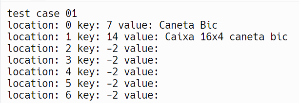
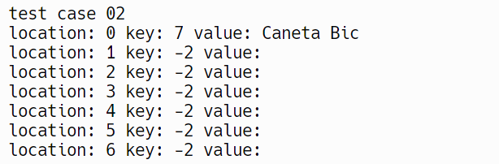
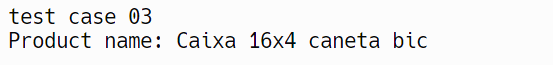
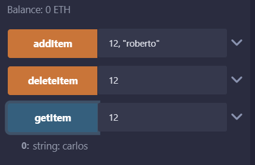
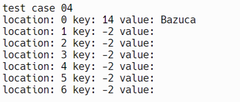
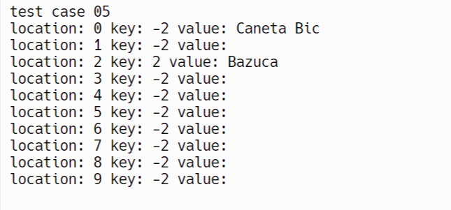

# Casos de Teste

 |Nº| Nome | pré-condição | etapas do teste | pós-condição |
 |--|------|--------|-----------------|--------------|
 |1 | Adição de itens que colidem | Nenhum | 1 - Criar uma tabela hash com tamanho X; 2 - Criar item1 com id igual a X e nome qualquer; 3 - Criar item2 com id igual a 2X e nome qualquer; 4 - Inserir item1; 5 - Inserir item2; 6 - Imprima a tabela hash | Deve haver os dois itens, sendo que o item1 está na posição 0 e o item2 na posição 1 |
 | 2 | Remoção de um item que sofreu colisão | estado final do teste 01 | 1 - Remova o item2 da tabela hash; 2 - Imprima a tabela hash | Deve haver apenas o item1 na tabela |
 | 3 | Encontrar um item que sofreu colisão | Estado final do teste 01 | 1 - Procure o item1 e imprima-o | é esperado  que apareça o valor do item1 |
 | 4 | Adição de um item que irá colidir com um item prévio de id nulo | Nenhuma | 1 - Crie uma tabela hash de tamanho 7; 2 - Adicione um item de id  -2 (nulo) e nome qualquer; 3 - Adicione um item de id 2 e nome qualquer; 4 - Imprima a tabela hash | é esperado que apareça apenas o ultimo item adicionado |
 | 5 | Adição de um item de id nulo que irá colidir com o próximo item | Nenhum | 1 - Crie uma tabela Hash com tamanho 4; 2 - Insira um item com id 2 e nome qualquer; 3 - Insira um item com id nulo (-2) e nome qualquer; 4 - Imprima a tabela | Deve aparecer apenas o ultimo item inserido |

 # Resultado real

Caso de teste 1 no C++
 
 
 
Resultado real igual ao resultado esperado.

Caso de teste 2 no C++
 

 
Resultado real igual ao resultado esperado.

Caso de teste 3 no C++
 

 
Resultado real igual ao resultado esperado.

Caso de teste 3 no Solidity
 

 
Resultado real igual ao resultado esperado.

Caso de teste 4 no C++
 

 
Resultado real igual ao resultado esperado.

Caso de teste 5 no C++
 

 
Resultado real diferente do resultado esperado. Isso se deve ao fato do array não ter posição -2 (-2 % 10) e lidar com isso como se fosse uma colisão, de modo a "empurrar" o item até a casa 0.